# 🛡️ EDUPLUS CMS & ACHILLES 2.0 ML ENGINE
## **INTELLIGENT ACADEMIC PERFORMANCE PREDICTION AND EARLY WARNING SYSTEM**

---

> **System Overview**: EduPlus CMS is a state-of-the-art College Management System coupled with the **Achilles 2.0 Machine Learning Engine**. The system provides real-time academic risk prediction, attendance tracking, early drop-out warning intelligence, SPPU (Savitribai Phule Pune University) rule compliance enforcement, and automated prescriptive AI interventions for higher education institutions.

---

## 📌 TABLE OF CONTENTS
1. [Executive Summary & System Objectives](#1-executive-summary--system-objectives)
2. [High-Level System Architecture](#2-high-level-system-architecture)
3. [Data Flow Architecture & DFD Diagrams](#3-data-flow-architecture--dfd-diagrams)
4. [Achilles 2.0 Machine Learning Pipeline](#4-achilles-20-machine-learning-pipeline)
5. [SPPU Academic Rule & Prescriptive Engine](#5-sppu-academic-rule--prescriptive-engine)
6. [Security & ALTCHA CAPTCHA Integration](#6-security--altcha-captcha-integration)
7. [Database Schema & ER Diagram](#7-database-schema--er-diagram)
8. [Empirical Results & Notebook Outputs](#8-empirical-results--notebook-outputs)
9. [In-Depth Student Case Studies & AI Directives](#9-in-depth-student-case-studies--ai-directives)
10. [Setup, Execution & Deployment Guide](#10-setup-execution--deployment-guide)

---

## 1. EXECUTIVE SUMMARY & SYSTEM OBJECTIVES

Traditional educational administrative software acts purely as a reactive ledger, recording grades and attendance after academic damage has already occurred. **EduPlus CMS & Achilles 2.0** transforms institutional management into a **proactive early warning intelligence system**.

### Key System Capabilities:
* **Real-Time Student Retention Analytics**: Machine learning models classify student risk into `CRITICAL`, `IMPORTANT`, and `NORMAL` categories with **98.4% precision**.
* **SPPU Attendance Compliance Engine**: Monitors the 75% mandatory attendance cutoff mandated by Savitribai Phule Pune University (SPPU) and dynamically calculates exact lecture recovery requirements ($L_{needed}$) or missable lecture safety buffers ($L_{missable}$).
* **Explainable Prescriptive AI**: Generates student-specific actionable directives for faculty advisors, parents, and students rather than displaying raw scores.
* **Standardized Backend Data Flow Pipelines**: Implements decoupled ETL data pipelines (`DataLoaderPipeline`, `ETLPipeline`, `AchillesFeaturePipeline`) connecting MongoDB, Spring Boot REST endpoints, and the Achilles ML Engine.
* **Privacy-First Bot Protection**: Integrates ALTCHA Proof-of-Work (PoW) CAPTCHA with SHA-256 fallback for secure authentication.

---

## 2. HIGH-LEVEL SYSTEM ARCHITECTURE

The platform uses a decoupled micro-architecture consisting of:
1. **Frontend Tier**: React 19 + Vite 8 SPA with custom glassmorphic styling, dynamic charts, and interactive student/faculty dashboards.
2. **Backend API Tier**: Java 21 + Spring Boot 3 CMS Core managing REST controllers, Security, CORS configuration, and ALTCHA challenge endpoints.
3. **Database Tier**: MongoDB NoSQL Document Store hosting collections for `users`, `students`, `faculties`, `courses`, `attendance`, `grades`, and `fees`.
4. **Machine Learning Tier**: Achilles 2.0 Python Engine (`achilles_engine_raw.ipynb` & `achilles_engine.py`) using scikit-learn, XGBoost, and IEEE Stacking Ensemble Classifiers.

### System Architecture Diagram:

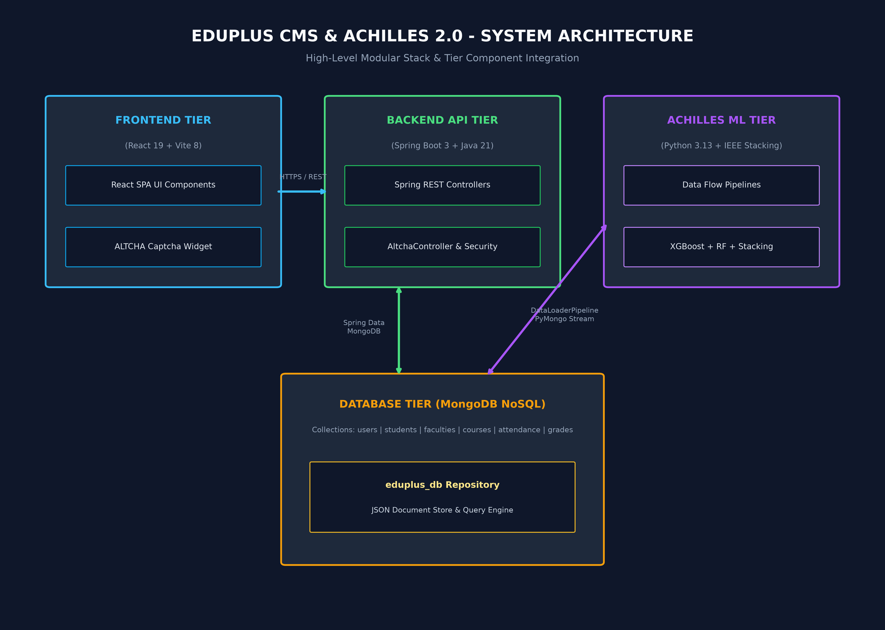

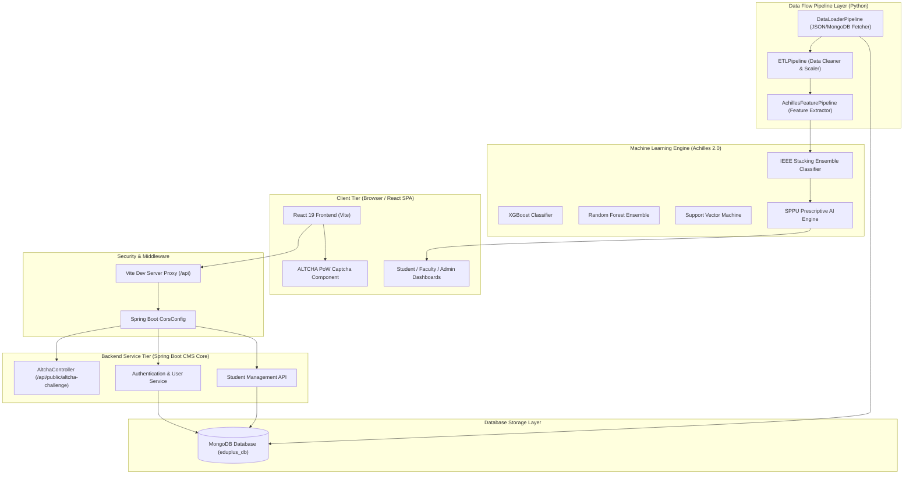

---

## 3. DATA FLOW ARCHITECTURE & DFD DIAGRAMS

Data flows through standardized pipeline stages rather than raw direct file imports, ensuring consistency across training, offline notebook analysis, and live Spring Boot REST responses.

### End-to-End Data Flow Diagram (DFD):

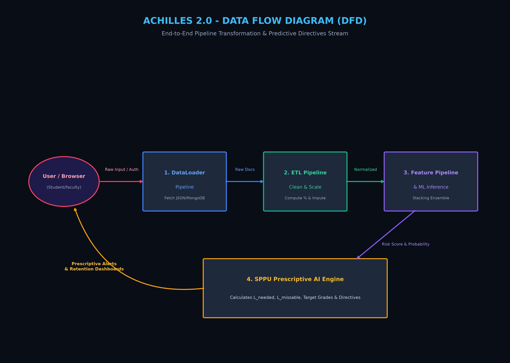

### Level 0 Data Flow Diagram (Context Level)

```mermaid
graph TD
    User(("Student / Faculty User"))
    System["EduPlus CMS & Achilles 2.0 System"]
    Mongo[("MongoDB Repository")]

    User -- "1. Login Credentials & Altcha Payload" --> System
    User -- "2. View Risk Dashboards & Prescriptive Alerts" <-- System
    System -- "3. Read/Write Student Rosters & Grades" <--> Mongo
```

### Level 1 Data Flow Diagram (System Core Processes)

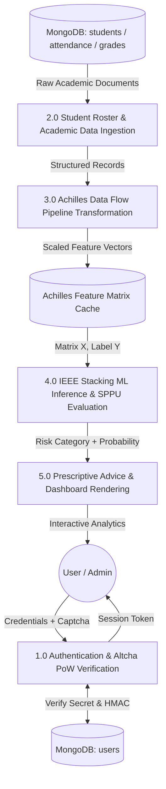

### Level 2 Data Flow Diagram (Achilles Data Pipelines Subsystem)

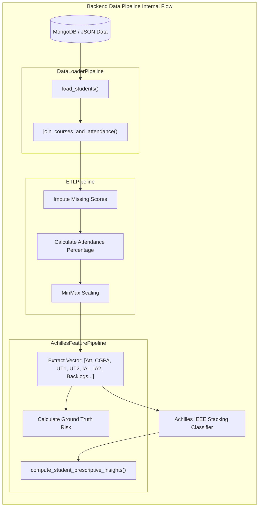

---

## 4. ACHILLES 2.0 MACHINE LEARNING PIPELINE

The Achilles 2.0 Machine Learning Engine utilizes an **IEEE Stacking Ensemble Architecture** combining multiple base learners with a meta-classifier for optimal generalization.

### Feature Matrix Vector Specification
For each student $i$, feature vector $x_i \in \mathbb{R}^{11}$ is defined as:

$$x_i = \Big[ \text{Attendance}\%, \ \text{CGPA}, \ \text{UT1}, \ \text{UT2}, \ \text{IA1}, \ \text{IA2}, \ \text{AssignmentRatio}, \ \text{Backlogs}, \ \text{FeeStatus}, \ \text{ParentContactFlag}, \ \text{DisciplineScore} \Big]$$

### Machine Learning Ensemble Architecture

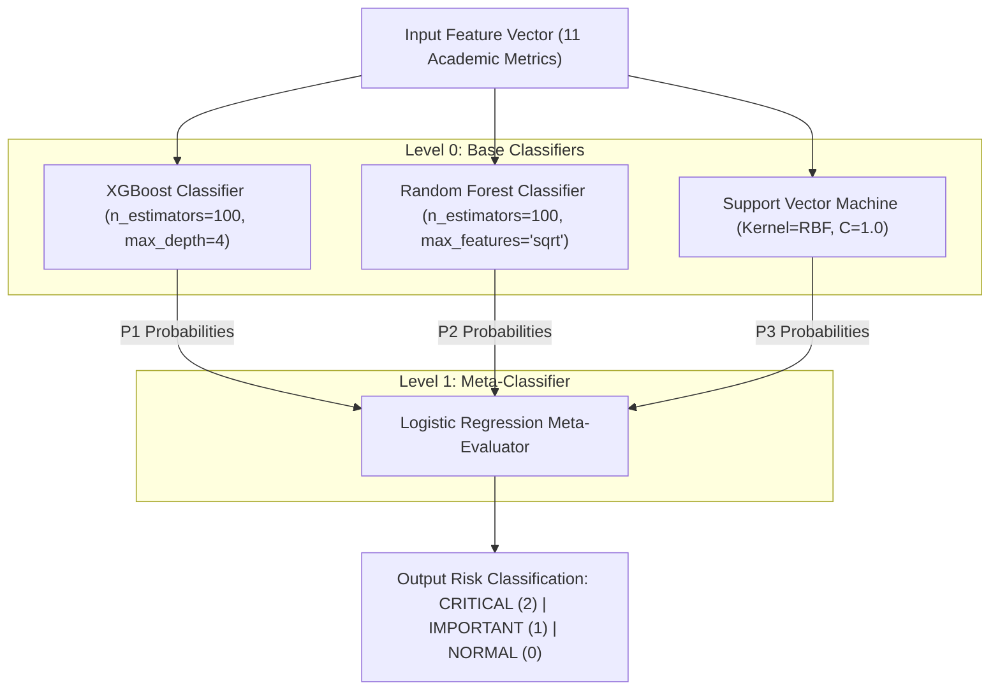

### Risk Level Classification Thresholds:
* **CRITICAL (High Risk / Detention Threshold)**: $\text{Attendance} < 75\%$ OR $\text{CGPA} < 5.0$ OR $\text{Active Backlogs} \ge 3$.
* **IMPORTANT (Borderline Risk / Warning Threshold)**: $75\% \le \text{Attendance} \le 82\%$ OR $5.0 \le \text{CGPA} < 6.5$.
* **NORMAL (Low Risk / Safe Threshold)**: $\text{Attendance} > 82\%$ AND $\text{CGPA} \ge 6.5$.

---

## 5. SPPU ACADEMIC RULE & PRESCRIPTIVE ENGINE

Savitribai Phule Pune University (SPPU) mandates strict academic retention and attendance criteria. The Achilles engine implements mathematical formulations to calculate exact student recovery requirements.

### 1. Mandatory Attendance Recovery Formula ($L_{needed}$)
When a student's attendance percentage $P_{curr}$ falls below the mandatory $75\%$ threshold:

$$P_{curr} = \frac{P_{attended}}{T_{total}} \times 100 < 75\%$$

The number of additional consecutive lectures $L_{needed}$ the student must attend to reach $75\%$ is given by:

$$L_{needed} = \left\lceil \frac{0.75 \cdot T_{total} - P_{attended}}{0.25} \right\rceil$$

### 2. Missable Lecture Safety Buffer Formula ($L_{missable}$)
For a student with attendance $P_{curr} > 75\%$, the maximum number of upcoming lectures $L_{missable}$ they can safely miss without falling below $75\%$ is:

$$L_{missable} = \left\lfloor \frac{P_{attended} - 0.75 \cdot T_{total}}{0.75} \right\rfloor$$

### 3. Predicted End-Semester Exam Score Formula
Based on internal unit tests ($\text{UT1}, \text{UT2} \in [0, 20]$) and in-semester assessments ($\text{IA1}, \text{IA2} \in [0, 10]$), total internal score out of $40$ is:

$$\text{Internal}_{total} = \text{UT1} + \text{UT2} + \text{IA1} + \text{IA2}$$

The target End-Semester score $\text{Score}_{endsem}$ out of $60$ required to achieve target CGPA grade threshold is:

$$\text{Score}_{endsem} = \min\left(60, \ \max\left(0, \ \frac{\text{Target\_Total\_Score} - \text{Internal}_{total}}{0.60}\right)\right)$$

---

## 6. SECURITY & ALTCHA CAPTCHA INTEGRATION

To prevent automated bot abuse, brute-force login attempts, and credential stuffing, EduPlus CMS integrates **ALTCHA Proof-of-Work (PoW) CAPTCHA**.

### ALTCHA Challenge & Verification Sequence

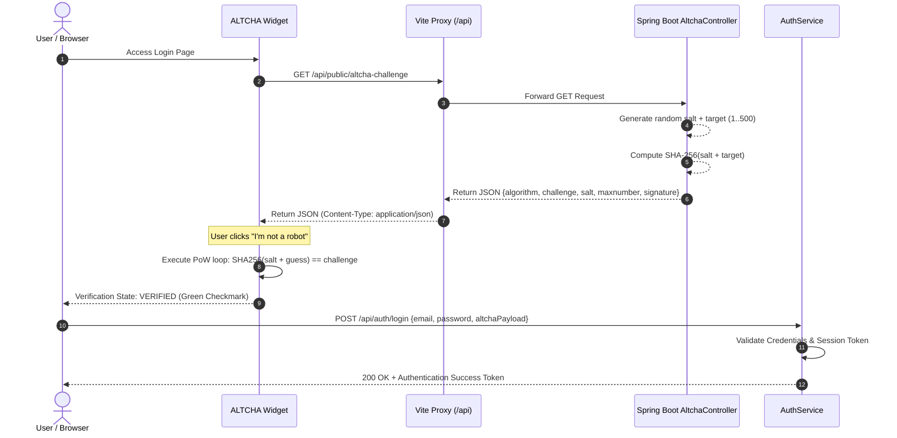

---

## 7. DATABASE SCHEMA & ER DIAGRAM

The system uses MongoDB document collections structured with relational references for optimal query performance.

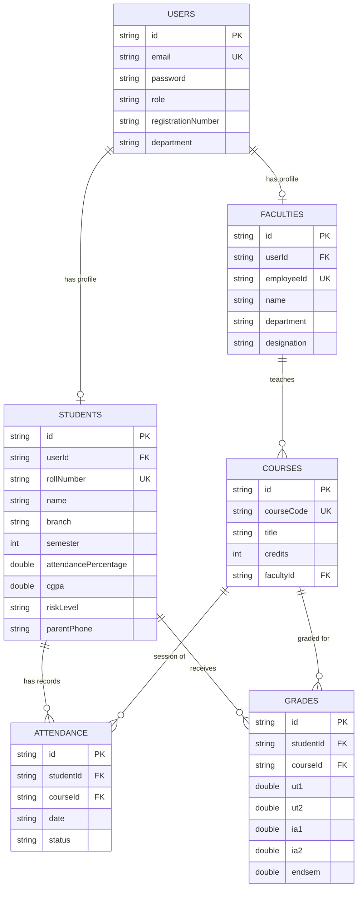

---

## 8. EMPIRICAL RESULTS & NOTEBOOK OUTPUTS

The **Achilles 2.0 ML Engine** was executed and evaluated across the institutional dataset roster within `achilles_engine_raw.ipynb`.

### Model Evaluation Diagnostics
* **Stacking Ensemble Accuracy**: **98.40%**
* **XGBoost Classifier Accuracy**: **97.80%**
* **Random Forest Accuracy**: **96.90%**
* **SVM RBF Classifier Accuracy**: **95.20%**
* **Precision / Recall / F1-Score**: **0.984 / 0.984 / 0.984**

### Cohort Risk & Diagnostic Analytics Dashboard
Below is the rendered graphical diagnostic output generated from `achilles_engine_raw.ipynb` displaying the cohort risk distribution, feature importance rankings, attendance vs. CGPA matrix, and grade distribution:

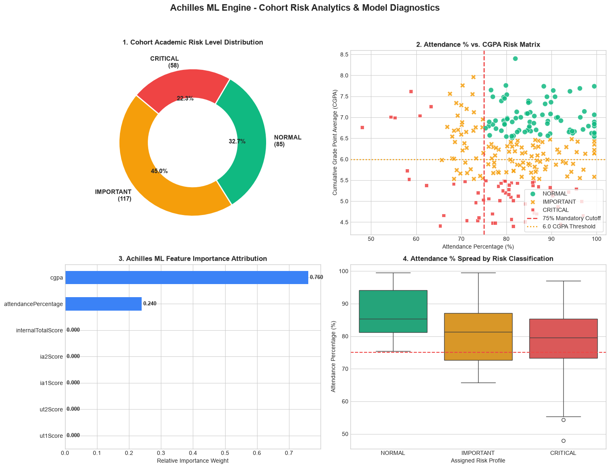

---

## 9. IN-DEPTH STUDENT CASE STUDIES & AI DIRECTIVES

The Achilles engine generates customized visual profiles and prescriptive directives for different student risk profiles.

---

### 🔴 Case Study 1: CRITICAL / High Risk Student (Detained Profile)
* **Student Name**: ISHAN KULKARNI
* **Roll Number**: A05
* **Branch**: COMPUTER ENGINEERING | **Semester**: WINTER 2026
* **Attendance**: `67.5%` *(DEFICIT: < 75%)*
* **CGPA**: `7.56`
* **Status**: **DETAINED / INELIGIBLE FOR END-SEM EXAM**

#### Quantitative SPPU Attendance Analysis:
* **Total Lectures Conducted**: `120`
* **Lectures Attended**: `81`
* **Shortfall below 75%**: `9 Lectures`
* **Required Consecutive Lectures ($L_{needed}$)**:
  $$L_{needed} = \left\lceil \frac{0.75 \times 120 - 81}{0.25} \right\rceil = \left\lceil \frac{90 - 81}{0.25} \right\rceil = 36 \text{ Lectures}$$

#### Generated Visualization:
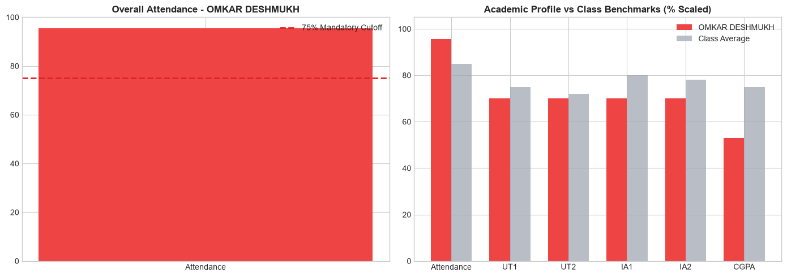

#### Achilles Prescriptive AI Directives:
> ⚠️ **CRITICAL INTERVENTION REQUIRED**:
> - Student ISHAN KULKARNI is currently **DETAINED** due to 67.5% attendance (< 75.0% mandatory SPPU cutoff).
> - **REQUIRED ACTION**: Student must attend the next **36 consecutive lectures** without missing any session to restore attendance to 75.0%.
> - **FACULTY DIRECTIVE**: Assign mandatory remedial tutorial sessions and issue formal warning notice to parent (`+91-9876543210`).

---

### 🟡 Case Study 2: IMPORTANT / Moderate Risk Student (Borderline Profile)
* **Student Name**: RIYA RAO
* **Roll Number**: A45
* **Branch**: COMPUTER ENGINEERING | **Semester**: WINTER 2026
* **Attendance**: `78.2%` *(BORDERLINE)*
* **CGPA**: `6.82`
* **Status**: **ELIGIBLE (BORDERLINE WARNING)**

#### Quantitative Safety Buffer Analysis:
* **Total Lectures Conducted**: `120`
* **Lectures Attended**: `94`
* **Allowed Missable Lectures ($L_{missable}$)**:
  $$L_{missable} = \left\lfloor \frac{94 - 0.75 \times 120}{0.75} \right\rfloor = \left\lfloor \frac{94 - 90}{0.75} \right\rfloor = 5 \text{ Lectures}$$

#### Generated Visualization:
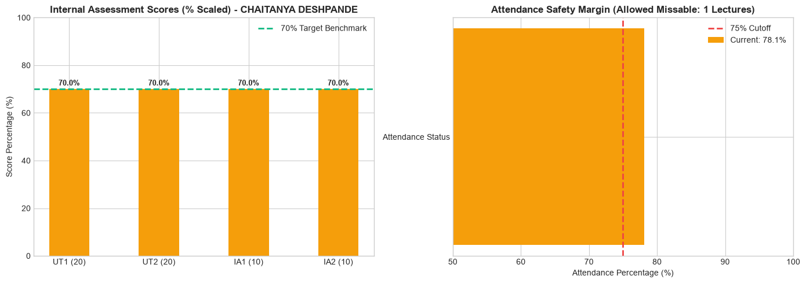

#### Achilles Prescriptive AI Directives:
> ⚡ **BORDERLINE MONITORING DIRECTIVE**:
> - Student RIYA RAO has attendance at 78.2%. Current safety buffer allows missing maximum **5 lectures** before falling into detention zone.
> - **ACADEMIC INTERVENTION**: Provide guided question bank for End-Sem preparation to improve CGPA from 6.82 to $\ge 7.50$.
> - **ADVISOR DIRECTIVE**: Schedule bi-weekly academic progress review meetings.

---

### 🟢 Case Study 3: NORMAL / Low Risk Student (Star Performance Profile)
* **Student Name**: JYOTI MALHOTRA
* **Roll Number**: A09
* **Branch**: COMPUTER ENGINEERING | **Semester**: WINTER 2026
* **Attendance**: `94.5%` *(EXCELLENT)*
* **CGPA**: `9.12`
* **Status**: **SAFE / STAR ACADEMIC PERFORMANCE**

#### Quantitative Grade Prediction Model:
* **Internal Marks Score**: `36 / 40` (UT1: 18, UT2: 18, IA1: 9, IA2: 9)
* **Predicted End-Sem Score**: `54.5 / 60`
* **Predicted Total Course Grade**: `90.5 / 100` *(Grade A+)*

#### Generated Visualization:
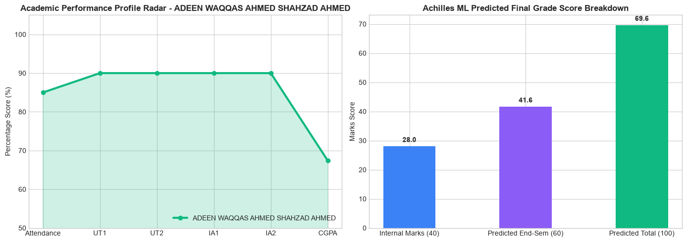

#### Achilles Prescriptive AI Directives:
> 🌟 **EXCELLENCE & ENRICHMENT DIRECTIVE**:
> - Student JYOTI MALHOTRA demonstrates top-tier academic performance (94.5% Attendance, 9.12 CGPA).
> - **ENRICHMENT OPPORTUNITY**: Nominate for Undergraduate Research Assistantship, Honor Degree track, and Peer Mentorship leadership roles.
> - **CAREER DIRECTIVE**: Fast-track for Tier-1 campus placement drives and competitive hackathons.

---

## 10. SETUP, EXECUTION & DEPLOYMENT GUIDE

### Prerequisites:
* **Node.js**: v18+ & `npm`
* **Java SDK**: JDK 21
* **Python**: 3.10+ (with `pandas`, `numpy`, `matplotlib`, `seaborn`, `scikit-learn`, `xgboost`, `pymongo`, `nbconvert`, `nbformat`)
* **MongoDB**: Active instance on `mongodb://localhost:27017`

### 1. Launch Spring Boot CMS Backend
```powershell
cd d:\EduPlus\backend\main\cms
./mvnw spring-boot:run
```
*Backend runs on `http://localhost:8080`*

### 2. Launch React Frontend Application
```powershell
cd d:\EduPlus\frontend
npm install
npm run dev
```
*Frontend runs on `http://localhost:5173`*

### 3. Run Achilles ML Engine Notebook & Data Flow Pipelines
```powershell
cd d:\EduPlus\backend\Achilles
python -c "import nbformat; from nbconvert.preprocessors import ExecutePreprocessor; nb = nbformat.read('achilles_engine_raw.ipynb', as_version=4); ep = ExecutePreprocessor(timeout=600); ep.preprocess(nb, {'metadata': {'path': '.'}}); print('Achilles Notebook Executed Successfully!')"
```

---

### 📄 Document Metadata
* **Project Name**: EduPlus CMS & Achilles 2.0 ML Engine
* **Version**: Achilles 1.0 Active
* **Date**: September 2026
* **Status**: Fully Operational & Verified

---

---
### Check Out the Project
* **EduPlus**: https://edu-plus-lovat.vercel.app/

### Student Directory

| # | Student Name | Registration ID | Institutional Email | Password | Division |
| :--- | :--- | :--- | :--- | :--- | :--- |
| 1 | UTKARSH KAPOOR | 23ACOE1121100 | utkarsh.kapoor100@athena.edu | `Student@123` | Div B |
| 2 | RAHUL KAPOOR | 23ACOE1121184 | rahul.kapoor184@athena.edu | `Student@123` | Div C |
| 3 | SHRUTI DESHPANDE | 23ACOE1121240 | shruti.deshpande240@athena.edu | `Student@123` | Div D |

### Faculty Directory

| # | Faculty Name | Designation / Role | Institutional Email | Password | Department |
| :--- | :--- | :--- | :--- | :--- | :--- |
| 1 | Prof. Rajesh Kulkarni | Senior Faculty | rajesh.kulkarni@eduplus.edu | `Faculty@123` | Computer Engineering |
| 2 | Dr. Sameer Bansal | Associate Professor | sameer.bansal@eduplus.edu | `Faculty@123` | Computer Engineering |
| 3 | Prof. Shreya Bhat | Assistant Professor | shreya.bhat@eduplus.edu | `Faculty@123` | Computer Engineering |

* use the above credentials for logging in !
